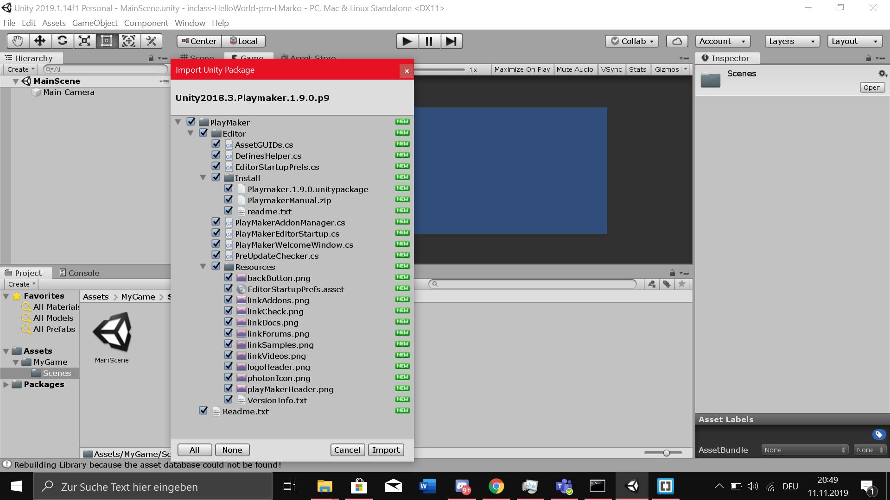

## inClass-HelloWorld-pm-LMarko

## Developement Platform: 
MacOS Mojave (10.14.6), Unity 2019.1.14f1, Visual Studio Code 1.38.1

## Description: 
2D project, practicing create unity project lokally and on GitHub, make the first Playmaker Project.
## Target Platform:

WebGL (refRes: 1280x720)
Screenshot: 

## Third Party Material: 
Playmaker 1.9.0.p9

## Lesson learned: 
How to set up may first Playmaker Game
